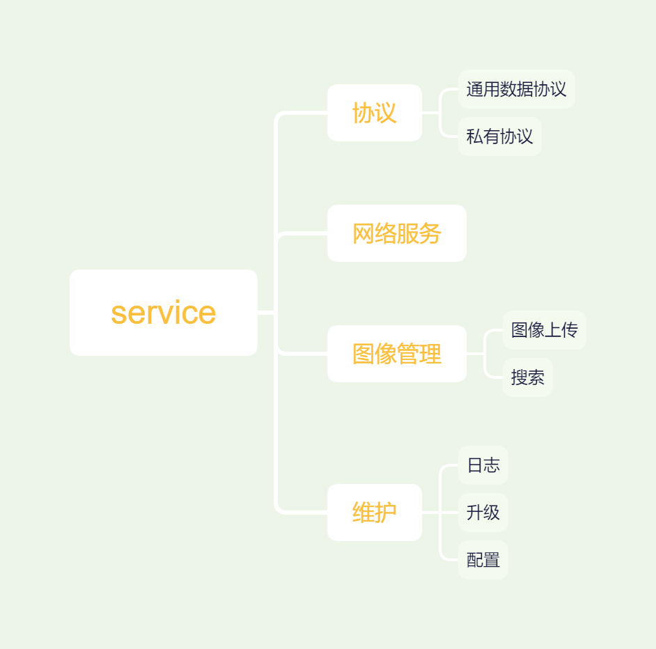

# 设计文档

> 目的在于开发一个深度学习的平台，目前主要用于使用云服务器做图像识别，图像管理。

## 系统结构图

- `service`类似于运行于服务器的管理核心；
- 私有客户端接入服务器，使用私有协议完成配置管理、图像管理、升级等功能；
- 三方客户端接入服务器提供的共有服务；
- 私有`web`服务器类似于私有客户端，只不过提供`web`服务；
- 深度学习算法，用于使用训练模型产出送入的图像信息。

## 开发技术原理

- `service`使用`c++`开发；
- 深度学习算法使用`python`开发；
- 私有客户端：`PC`-`python`，安卓-`nodejs`；
- 私有`web`服务器使用`nodejs`、`vue`开发；
- 私有协议采用扩展性强的`json`格式；
- 软件结构采用多线程。

## service

**框架图**: