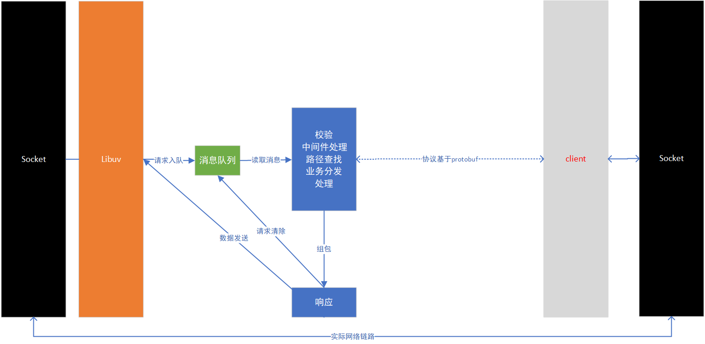

# `SDK`设计文档

# 目录

[TOC]

## 1. 目录说明

- `sdk_network`为`sdk`网络
- `sdk_protocol`为`sdk`协议
- `sdk_tree`为`sdk`节点树

## 2.`sdk`网络详细设计

### 2.1 总体说明

- 网络架构基于`libuv`，采用异步网络

- 协议基于`protobuf3`，跨平台更友好

- `sdk`网络只做服务器，处理请求消息并应答

- 支持并发，但是消息采用流式处理

  - 创建消息队列池，做大小限制，先入先出原则

    ```cpp
    /**
     * @brief sdk处理数据包
     * 
     * @tparam T 
     */
    template <class T>
    struct sdk_package
    {
    	T *handle;			///< uv handle
    	bool (*write)(T *handle, const std::string &data);	///< 响应回调接口
    };
    ```

    其中`handle`为`libuv`不同类型的协议句柄；`write`为消息响应的发送回调接口。

    ```cpp
    // tcp消息队列
    static std::list<sdk_package<uv_stream_t>*> stream_list;
    ```

    

  - 收到请求，直接入队返回，等待请求消息

    ```cpp
    template <> bool push_sdk_package<uv_stream_t>(sdk_package<uv_stream_t> *package)
    {
    	if (!package)
    	{
    		log_w("package is null\n");
    		return false;
    	}
    
    	// 队列已满
    	if (stream_list.size() >= MAX_STREAM_LIST_LEN)
    	{
    		// FIXME:入队失败如何处理，入队失败直接进行处理,积累过多消息会导致资源不足
    		log_w("stream list full!\n");
    		return false;
    	}
    
    	stream_list.push_back(package);
    
    	return true;
    }
    ```

    

  - `sdk`消息处理任务实时读取消息队列

    ```cpp
    for (;;)
    {
        task_alive(tid);
    
        if (stream_list.empty()) { continue; }
    
        // 获取队列首部消息
        sdk_package<uv_stream_t> *package = stream_list.front();
    
    	...
    }
    ```

    

  - 读取消息，处理后出队

    ```cpp
    // 处理sdk tcp消息
    sdk_stream_do(package);
    
    // 消息出队
    stream_list.pop_back();
    delete package;
    package = nullptr;
    ```

    

### 2.2 实现逻辑

1. 初始化`libuv`，用于启用`libuv`库

   ```cpp
   void UvEvent::uv_event_init(void)
   {
   	loop = uv_default_loop();
   }
   
   ...
   
   void UvEvent::uv_event_run(void)
   {
   	log_d("run loop\n");
   	uv_run(loop, UV_RUN_DEFAULT);
   	log_d("run error\n");
   }
   ```

   

2. 创建`libuv`网络实例，用于`sdk`模块通信

   ```cpp
   uv_sdk_net_server->create_tcp_server(ip, port);
   ```

   

3. 创建消息分发任务

   ```cpp
   void task_sdk_package_distribution_init(void)
   {
       task_create(task_sdk_stream_do, STACKSIZE(50*1024), "task_sdk_stream_do", OS_MIN(5), E_TASK_IGNORE);
   }
   ```

   

4. `sdk`网络实例收到请求后，消息入队

   ```cpp
   package = new sdk_package<uv_stream_t>;
   data = new uv_buf_t(std::move(uv_buf_init(buf->base, buf->len)));
   
   package->handle = client;
   package->handle->data = (void *)data;
   package->write = uv_stream_write;
   
   // 数据入栈
   push_sdk_package(package);
   ```

   

5. 消息分发任务读取队列

   ```cpp
   sdk_package<uv_stream_t> *package = stream_list.front();
   ```

   

6. 消息校验

   ```cpp
   if (!sdk_decode_req_msg(req, sdk_req) || !sdk_header_check(sdk_interface, sdk_req))
   {
   	return ;
   }
   ```

   

7. 中间件处理

   ```cpp
   if (!sdk_midware_proc(sdk_interface, sdk_req, sdk_res))
   {
       // 中间件响应消息不走正常流程，单独存在错误码，会填写具体中间件
       sdk_encode_res_msg(sdk_interface, sdk_req, sdk_res, res);
       return ;
   }
   ```

   

8. `url`查找

   ```cpp
   sdk_app_node_fn fn = find_url_function(body.method(), url);
   ```

   

9. 业务模块处理

   ```cpp
   fn(sdk_interface, sdk_req, sdk_res);
   ```

   

10. 消息应答

    ```cpp
    package->write(package->handle, res_data);
    ```

    

11. 消息出队

    ```cpp
    stream_list.pop_back();
    delete package;
    package = nullptr;
    ```

    



## 3.`sdk`协议详细设计

### 3.1 总体说明

协议部分采用`google`的开源`protobuf`，当前使用版本`3`，有点在于跨平台、效率高、接口丰富。

参考`http`协议`REST`架构。

```protobuf
message Sdk {
    Header header = 1;      ///< 协议头
    Body body = 2;          ///< 协议内容
    Footer footer = 3;      ///< 协议脚标，只有返回有用
}
```

### 3.2 协议头

```protobuf
message Header {
    // 魔术数字
    SdkMagic msg_magic = 1;
    // 版本，必须校验SDK_CUR_VERSION
    SdkVersion version = 2;
    // 包序号
    int64 pack_id = 3;
    // 数据时间
    DataTime time = 4;
    // 数据方向
    DataFlow data_dir = 5;
    // 源地址
    Host host = 6;
    // 目的地址
    Host dest = 7;
    // 传输协议
    TransProto trans_proto = 8;
}
```

### 3.3. 主体部分

与`http`有区别的地方在于，路径及方法在主题部分：

```protobuf
// 请求动作，参考http实现
enum OperationType {
    INVALID = 0;            // 无效
    GET = 1;                // get用于获取资源
    POST = 2;               // 用于上传资源，主要是存储，比如升级，上传文件等
    PUT = 4;                // 用于资源状态设置
    DELETE = 8;             // 用于删除资源
}

message Body {
    UserSessionMsg user_session = 1;
    string url = 2;  // 请求路径，所有请求的响应使用路径与函数映射
    OperationType method = 3;
    Content content = 5;  // 数据内容，登录等处时并不需要
}
```

`user_session`表示用户信息。

`url`表示资源路径，`method`表示方法，必须严格遵守`OperationType`说明。

`content`才是业务内容的数据。

### 3.4 业务内容数据

```protobuf
// 数据内容
message Content {
    // 占位
    int64 magic = 1;

    // 所有的业务数据协议放在此处,每条消息最多只有一个字段被赋值
	oneof ContentOneof {
        /********************* 管理系统协议内容 ***************************/

        // 模块列表，支持get/put
        AppModuleCoutInfoList app_module_list = 2;
        // 用户列表，支持get/put/delete
        UserList user_list = 3;
        
        /*********************** 开放协议内容 *****************************/
	}
}
```

所有数据放在`oneof ContentOneof`当中，每次都只能由一个数据被设置，因此不同业务内容的协议必须单独定义。另外不允许定义在此处，必须单独编译协议内容，导入在此处：

```protobuf
import "in_sdk_body_user.proto";
import "in_sdk_body_appmodule.proto";
```

### 3.5 协议返回结果

```protobuf
// 详细业务返回码，所有业务返回码定义在此处
enum ContentResultE {
    // 成功
    R_CODE_OK = 0;
    // 失败
    R_CODE_ERROR = 1;
    // 用户已经存在
    R_CODE_USER_EXIST = 2;
    // 用户token超时
    R_CODE_USER_TOKEN_TIMEOUT = 3;
    // 用户不存在
    R_CODE_USER_NOT_EXIST = 4;
    // 用户黑名单
    R_CODE_USER_IN_BLACK_LIST = 5;
    // 用户权限不足
    R_CODE_USER_NO_PERMISSION = 6;
    // 用户密码错误
    R_CODE_USER_PASS_ERROR = 7;
    // 用户生存时间过长，不支持
    R_CODE_USER_ALIVE_TIME_TOOLONG = 8;
}

// 消息协议响应结果
enum ResponseResult {
    OK = 0;         // 正常响应
    ERROR = 1;      // 异常响应
}

// 协议响应结果
message SdkResult {
    ResponseResult status_code = 1; // 响应结果状态码，发送方并不需要
    string code = 2;                // 响应短语
}

// 具体业务响应结果
message ContentResult {
    ContentResultE status_code = 1; // 响应结果状态码
    string code = 2;                // 响应短语
}

// 结果
message Result {
    // sdk响应结果
    SdkResult sdk_result = 1;
    // 业务响应结果
    ContentResult content_result = 2;
}

message Footer {
    int32 res = 1;      // 保留
    Result result = 2;  // 返回结果，发送方不需要
}
```

响应结果只有响应时有用，分`sdk`响应结果，与具体业务无关；`content_result`由具体业务自身填写返回结果。具体的业务结果内容仍然在主体协议内。

业务返回码`ContentResultE`统一放在此处，优点在于便于管理，缺陷在于过多返回码难以阅读。考虑折中方式。

## 4.`sdk`节点树详细设计

节点树用于处理`REST`。

### 4.1 节点定义

每条`url`对应一份资源，表现于：`method`与`function`。

```cpp
// sdk树节点
struct sdk_tree_node
{
	int method;							///< 节点方法
	std::string url;					///< 节点url
	sdk_app_node_fn fn;					///< 节点处理接口
	std::vector<const struct sdk_tree_node *> next;	///< 下级节点
};
```

`url`只支持数字、字母(区分大小写)、`-`、`_`、`/`。

```cpp
std::regex pat("[^/a-zA-Z_\\-0-9]");
```

### 4.2 实现方式

- 采用树形结构
- 支持分级
- 支持正则表达式匹配

```cpp
// 基础树(默认路径)
static std::vector<const struct sdk_tree_node *> base_sdk_tree = {
	sdk_url(GET, "index", _index_fn, nullptr),
};

// 添加根节点
MODULE_ADD_SDK_TREE(GET|PUT|POST|DELETE, "/", nullptr, base_sdk_tree);
```

**注意使用`MODULE_ADD_SDK_TREE`添加树路径会被添加到根，因此最好是每个模块内部定义好整棵树之后再统一添加。**

不使用`sdk`树引用具体业务模块内的树的方式，而是由每个模块调用`sdk_tree`提供的方法将自身的树注册到根节点，`sdk_tree`只负责逻辑部分。逻辑与数据分离。

```cpp
// sdk url
#define sdk_url(method, url, fn, next) new struct sdk_tree_node(method, url, fn, next)

// 添加sdk tree
const struct sdk_tree_node *add_sdk_tree(const struct sdk_tree_node *sdk_tree);

// 模块添加sdk tree，一个模块(文件)只能添加一个
#define MODULE_ADD_SDK_TREE(method, url, fn, next) \
	static std::vector<const struct sdk_tree_node *> ___sdk_tree___{add_sdk_tree(sdk_url(method, url, fn, next))}

const struct sdk_tree_node *add_sdk_tree(const struct sdk_tree_node *sdk_tree)
{
	// 冲突检测不做，以先查找到的为准(先添加)
	__sdk_tree_root.push_back(sdk_tree);

	return sdk_tree;
}
```

查找实现：

```cpp
// 递归查找路径，查用正则表达式匹配
static sdk_app_node_fn _search_url_function(const OperationType &method, const std::string &url, std::vector<const sdk_tree_node *> tree)
{
	if (tree.empty()) { return nullptr; }

	sdk_app_node_fn fn = nullptr;

	for (auto item : tree)
	{
        if (item->url.empty()) { continue; }

        std::smatch sm;
        // 路径当中忘了加^起始则添加，用于正则表达式
        std::regex pat(item->url[0] == '^' ? item->url : ("^" + item->url));

        // 路径未匹配或者method未匹配则跳过
        if (!std::regex_search(url, sm, pat) || !method_valid(method, item->method))
        {
            continue;
        }

        // 后缀为空则完全匹配
        if (sm.suffix().str().empty()) { return item->fn; }

        // 有后缀则查找url下级
        fn = _search_url_function(method, sm.suffix().str(), item->next);
        if (fn) { return fn; }
	}

	return nullptr;
}

// 查找url对应的处理接口
static sdk_app_node_fn find_url_function(const OperationType &method, const std::string &url)
{
	if (__sdk_tree_root.empty()) { return nullptr; }

	return _search_url_function(method, url, __sdk_tree_root);
}
```

### 4.3 计划

- 增加追加到某个节点下的方式
- 增加冲突检测